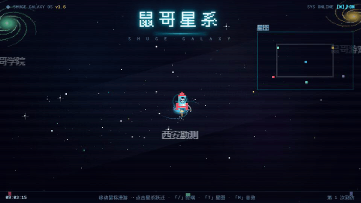

# SHUGE GALAXY · 鼠哥星系

> 一个可以漫游的个人项目入口：把游戏、学习工具、艺术实验与小作品连接成一片星系。



<sub>动态演示由真实浏览器连续截图合成，非概念动画。</sub>

**[进入星系 →](https://ndshuge.github.io/ndshuge-galaxy/)** · [互动艺术展厅](https://ndshuge.github.io/ndshuge-galaxy/art/) · [GitHub 项目列表](https://github.com/ndshuge?tab=repositories)

---

## 这是什么？

SHUGE GALAXY 是使用 HTML Canvas、CSS 与 JavaScript 实现的像素风交互式作品导航页。每个星系都是一个项目入口：可以自由漫游、点击跃迁，也可以使用快捷键与内置终端探索。

**推荐直接打开在线页面体验**，仅查看源代码无法呈现完整的动效、声音与交互。

## 操作方式

| 操作 | 效果 |
| --- | --- |
| 鼠标移动 / 触控 | 漫游星系 |
| 点击项目星系 | 跃迁到对应作品 |
| `/` | 打开终端 |
| `T` | 查看星图 |
| `M` | 切换声音 |

## 探索入口

| 区域 | 内容 | 访问 |
| --- | --- | --- |
| 星系主页 | 项目导航、星际跃迁 | [进入](https://ndshuge.github.io/ndshuge-galaxy/) |
| 艺术实验 | 生成艺术、数学与图像交互实验 | [进入](https://ndshuge.github.io/ndshuge-galaxy/art/) |
| 数学宇宙 | 混沌、分形、场与波等可视化 | [进入](https://ndshuge.github.io/ndshuge-galaxy/art/math-universe/) |
| 生活指南 | 独立的交互页面 | [进入](https://ndshuge.github.io/ndshuge-galaxy/life-guide/) |
| 西安 | 城市相关交互内容 | [进入](https://ndshuge.github.io/ndshuge-galaxy/xian/) |

## 本地运行

克隆仓库后打开 `index.html`。主要入口不需要打包，但少数子作品可能依赖 WebGL、音频权限、外部字体或静态资源；如直接通过 `file://` 访问存在浏览器限制，可使用本地 HTTP 服务器：

```bash
python -m http.server 8000
```

然后访问 `http://localhost:8000/`。

## 技术说明

- 主页：原生 JavaScript + Canvas 2D，无主页面构建步骤。
- 展品：每个子目录可采用自己的静态资源与渲染技术；部分内容包含 WebGL 3D 资源。
- 部署：GitHub Pages。
- 尊重系统的 `prefers-reduced-motion` 设置；建议使用最新版浏览器。

## 贡献与使用

欢迎在 [Issues](https://github.com/ndshuge/ndshuge-galaxy/issues) 中反馈无法打开、移动端排版和性能问题。代码与素材的开源许可证仍需逐项确认，在明确许可证前请勿假定可自由商用或再分发。

---

[个人主页](https://github.com/ndshuge) · [游戏厅](https://ndshuge.github.io/ndshuge-game/) · [学习学院](https://ndshuge.github.io/ndshuge-academy/)
